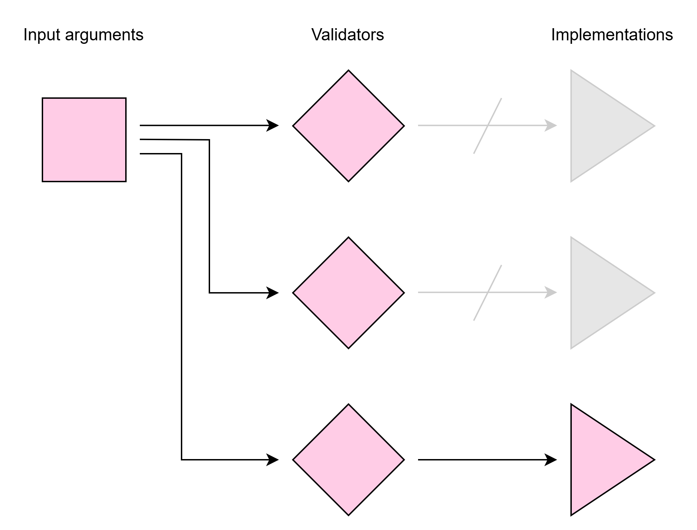

## Dispatching pattern

`argbox` can be used for function dispatching. Dispatching is a pattern where you redirect a function call to a specific implementation based on validation of the input arguments (essentially to avoid bloated code with many if-else statements):



You can use the Context class to create dispatching functionality. However, due to the usefulness of this concept we have created specialized helper functions in `argbox` for the purpose.

## Supported functions

Unlike many other dispatching libraries, here we supports **all** patterns of function definition and calling as described [here](./supported-functions.md), including positional arguments, keyword arguments, fixed number and variable number.

## Built-in dispatchers
We have provided some built-in dispatchers for the most common use cases

### (1) Dispatch on type
Dispatch based on the type of each the input argument.

```py
@argbox.dispatch_on_type
def add(x, y):
    ...

@add.register(float, float)
def _(x, y):
    return x + y

@add.register(str, str)
def _(x, y):
    return f"{x} + {y}"
```

### (2) Dispatch on rule
Dispatch based on checking a rule (i.e. a boolean-valued function) on each input argument:

```py
@argbox.dispatch_on_rule
def abs(x):
    ...

@abs.register(lambda x: x >= 0)
def _(x):
    return x

@abs.register(lambda x: x < 0)
def _(x):
    return -x
```

## Custom dispatcher
You can also build your own dispatcher using the following approach:

```py
import numpy as np

# define your dispatcher
@argbox.dispatcher # (1)!
def dispatch_on_numpy_dtype(*kinds: str):
    def validator(ctx: argbox.Context) -> bool: # (2)!
        for i, kind in enumerate(kinds):
            arg = ctx.get_arg(position=i)
            if not np.isdtype(arg.dtype, kind):
                return False
        return True

    return validator

# use your dispatcher on a function 
@dispatch_on_numpy_dtype # (3)!
def add(x, y):
    ...

@add.register("numeric", "numeric") # (4)!
def _(x, y):
    return x + y

@add.register(np.str_, np.str_) # (5)!
def _(x, y):
    return np.apply_along_axis(' + '.join, 0, [x, y]) 
```

1.  Use the `dispatcher` decorator to define your own dispatcher.
2.  Define the validator that is run upon a call to your function. When the validator returns `True`, the associated implementation will be used.
3.  Decorate a function using your dispatcher.
4.  Register an implementation for the function, which is used if the validator returns `True`.
5.  Register another implementation for the function, which is used if the validator returns `True`.

