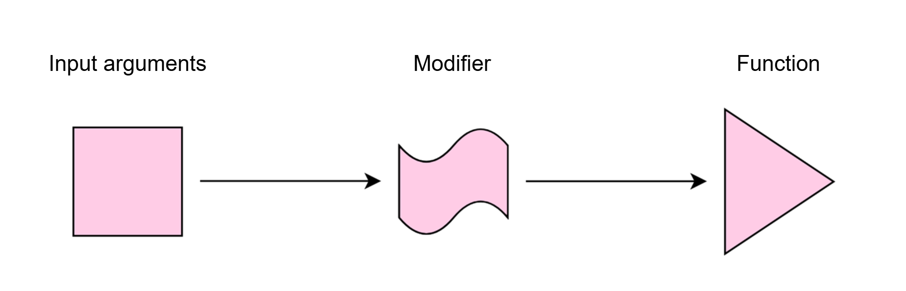

# Preprocessing

`argbox` can be used for function preprocessing. Preprocessing is a pattern, where you modify the input arguments prior to a function call:



## Built-in preprocessors
We have provided some built-in preprocessors for the most common use cases

### (1) Preprocess by transformations
Preprocess by transforming each input argument:

```py
@argbox.preprocess_by_transformations(
    lambda x: set(x),
    lambda y: set(y),
)
def intersect(x, y):
    return x.intersection(y)
```

## Custom preprocessors
You can also build your own preprocessor using the following approach:

```py
import numpy as np

# define your preprocessor
@argbox.preprocessor # (1)!
def bin_array_operator(ctx: argbox.Context) -> argbox.Context: # (2)!
    for i in [0, 1]:
        ctx = ctx.transform_arg(
            transformer=np.array,
            position=i,
        )
    return ctx

# use your preprocessor
@bin_array_operator # (3)!
def add(x, y):
    return x + y

@bin_array_operator # (4)!
def multiply(x, y, kind: str = "elementwise"):
    if kind == 'elementwise':
        return x * y
    if kind == 'dot':
        return np.dot(x, y)
    else:
        raise ValueError(f"Unknown kind: {kind}")
```

1.  Use the `preprocessor` decorator to define your own preprocessor.
2.  Define the modifier that is run upon a call to your function. The modifier will catch the input arguments before entering the function, and transform them as specified.
3. Decorate a function using your preprocessor.
4. Decorate another function using your preprocessor.